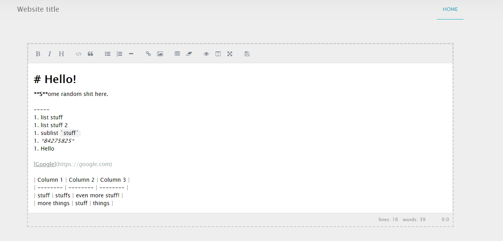

# SimpleMDE plugin for WonderCMS

## Description

This [WonderCMS] plugin adds [SimpleMDE] Markdown editor.

For page visitors the content will be parsed via [Marked].

## Preview

---

## How to use this plugin:

1. Have [WonderCMS] installed on your server.
2. Login as adminitstrator.
3. Find the plugin in the list.
   - Download and activate it.
4. You're done, the editors will open automatically!

[wondercms]: (https://github.com/robiso/wondercms)
[simplemde]: (https://github.com/sparksuite/simplemde-markdown-editor)
[marked]: (https://github.com/markedjs/marked)
